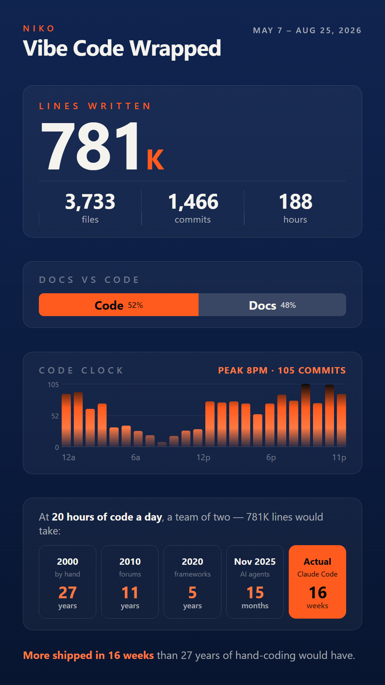

# Vibe Code Wrapped

A Claude Code skill that turns a git repo's history into a shareable, Spotify-Wrapped style stats card.

Point it at a repo. It asks you a few questions, reads the log, does the math, and writes one self-contained HTML file at exactly 1080x1920, true 9:16, so the whole card fits one phone screen.



Two details make it actually phone-safe:

- **It scales to the viewport.** On a 390px phone the card renders at 390x667. No horizontal scroll, no dead space under it, nothing cut off.
- **The clock bars are static HTML, not JS-generated.** Open it over `file://`, in an in-app browser, with scripts blocked, whatever. The data is still there.

## What it counts

| Stat | How it is measured |
|---|---|
| Lines written | Added lines across `--all --no-merges`, with lockfiles, `node_modules/`, `dist/`, `vendor/`, `.min.` and `.db` filtered out |
| Files | Unique paths ever touched |
| Commits | `git rev-list --all --no-merges --count` |
| Focused hours | Session-gap method. A gap over 90 minutes starts a new session, in-session gaps are summed. Conservative floor, not a guess. |
| Code clock | Commits per hour of day, local time, 24 bars, with a labelled y-axis so any hour is readable and not just the peak |
| Docs vs code | Conventional-commit prefixes. `docs:` on one side, everything else on the other. |
| Era time machine | The same line count at 2000 / 2010 / 2020 / Nov 2025 tooling rates against 20 person-hours a day, next to what it actually took with your AI tool |
| Date range | The real first and last commit in scope, not the window you asked for |

The era row is the point of the card. It puts "this took me 16 weeks" next to "this was 27 years of work in 2000."

Those era rates are a rough industry-shaped model, not a measurement. It is a brag, not a benchmark.

## What it asks you

Before it runs anything:

1. **Which AI coding tool to credit** - Claude Code, Cursor, Copilot, Codex, or your own. It goes in the highlighted final cell. Keep it short; the cell does not wrap.
2. **The name above the title** - a handle, a team name, or nothing.
3. **Full history or a date window.**
4. **Which repo** - defaults to the current directory.

## Safety

Worth knowing before you run it on a repo that is not yours.

**It reads** `git log` and `git rev-list`. Commit metadata only: timestamps, subject-line prefixes, changed paths, added-line counts.

**It never:**

- reads file contents, only the numbers in `--numstat`
- writes anything outside the output directory
- makes a network request, installs a dependency, or calls an API
- touches the working tree, the index, refs, or any remote - every git command is read-only
- reads `.env`, credentials, or anything outside the git history
- uploads, publishes or posts the card anywhere

The output is a local file. Publishing is always your own action.

**On a private or client repo, know what the card discloses.** It is derived data, and derived data still tells people things: total commits, total lines and file count give away the size and pace of the project; the code clock is an hour-by-hour activity histogram, so it shows when that person or team works, nights and weekends included; the header states the first and last commit dates. None of it is source code. On a client engagement it is often commercially sensitive anyway, and the histogram is personal information about whoever wrote the commits.

`--all` counts **every** author in the history. On a shared repo the focused hours and the clock are the team's, not yours. Say so if you post it.

## Install

Skills live in `~/.claude/skills/`. On Windows that is `%USERPROFILE%\.claude\skills\`.

```bash
git clone https://github.com/nikonadias/Code-Wrapped.git
cp -r Code-Wrapped/skills/code-wrapped ~/.claude/skills/
```

PowerShell:

```powershell
git clone https://github.com/nikonadias/Code-Wrapped.git
Copy-Item -Recurse Code-Wrapped\skills\code-wrapped "$env:USERPROFILE\.claude\skills\"
```

Restart Claude Code. Confirm it loaded with `/code-wrapped`.

For a project-local install instead, drop it in `.claude/skills/code-wrapped/` inside the repo.

## Use

```
/code-wrapped
```

Or just ask: "make me a vibe code wrapped for this repo."

Optional inputs, if you would rather not be asked:

- **repo** - path to the git repo. Defaults to the current directory.
- **name** - the eyebrow over the title, like `NIKO`.
- **tool** - the AI coding tool credited in the last era cell.
- **range** - a date window, for example `--since=2026-01-01 --until=2026-12-31`. Defaults to full history.
- **out** - output path. Defaults to `<repo>/scratch/code-wrapped/index.html`.

You get two files: `index.html` (opens on anything, scales to the screen) and `card.png` at 1080x1920, ready to post as-is. The PNG is usually the one you want.

## Re-theme it

Everything visual is in the `:root` block at the top of `skills/code-wrapped/template.html`.

```css
--navy0:#102450; --navy1:#0b1c3f; --navy2:#081530;   /* card gradient */
--paper:#f4f3ee;                                      /* text */
--orange:#FF5B1F; --orange2:#FF7841;                  /* the one accent */
```

Swap those five values and the whole card follows. The clock bars use a fixed-scale gradient so taller bars reveal more of the ramp. Keep `background-size:100% 176px; background-position:bottom` if you restyle them.

The card is a fixed 1080x1920 design in px units. Leave `.fit` as a plain block; the scale script sets its height so nothing pools underneath. Setting `display:flex` on the wrapper shrinks the stage and cramps everything on narrow viewports.

The stage uses `justify-content:space-between`, so spare vertical room spreads evenly between tiles. Add a section and you must re-run the fit check - the slack absorbs small additions silently right up until it does not.

## House rules the skill enforces

- No emojis anywhere on the card. Icons are inline SVG or typographic only.
- One accent color. Orange carries the eye, nothing else competes.
- Layout is verified numerically before it is called done, not eyeballed. Step 4 asserts the content overflows the 1920px box by exactly 0, that all 24 bars exist, that the gridlines land on 0/88/176, that no nowrap label is clipped, that every tile's content shares a left edge, and that a 390px viewport produces no horizontal scroll.

## Example

`example/index.html` and `example/preview.png` are a real card, generated from a private repo over 2026-05-07 to 2026-08-25: 781K lines, 3,733 files, 1,466 commits, 188 focused hours, peak hour 8pm.

## License

MIT. See [LICENSE](LICENSE).
